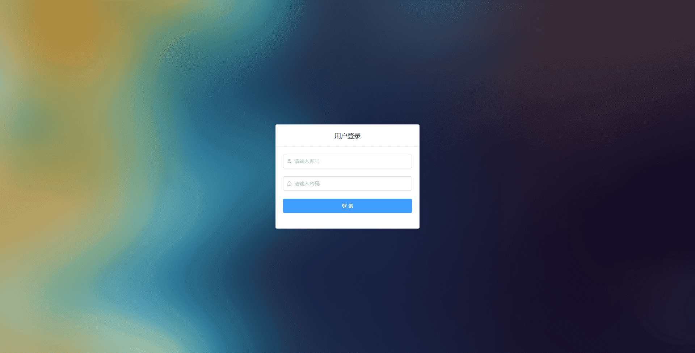
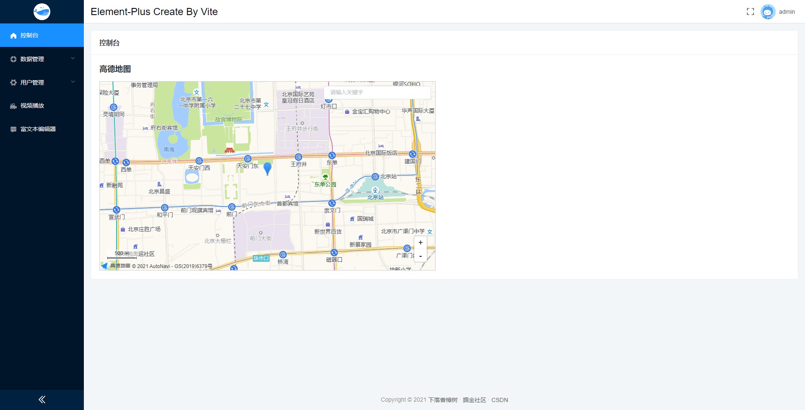
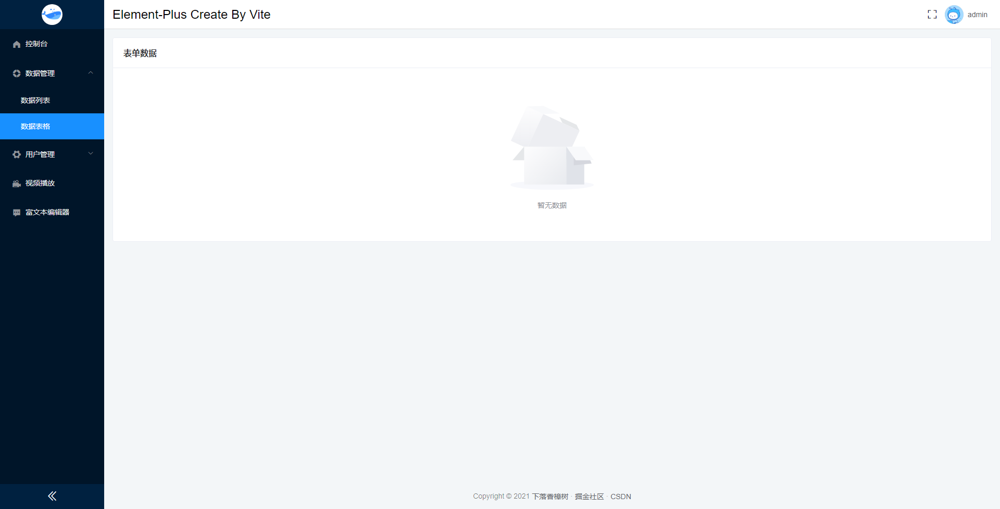
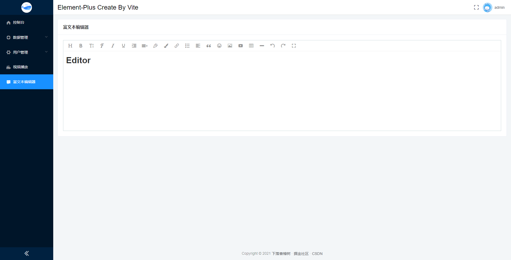
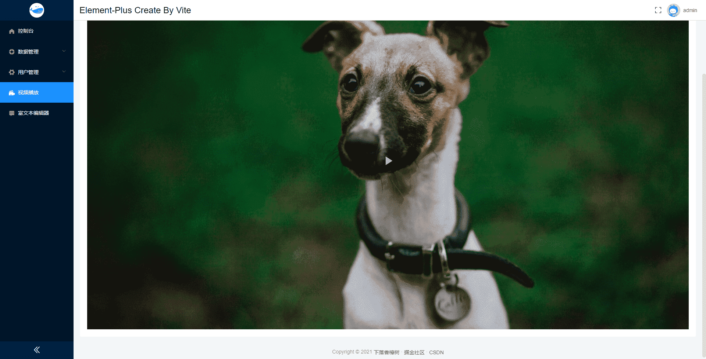
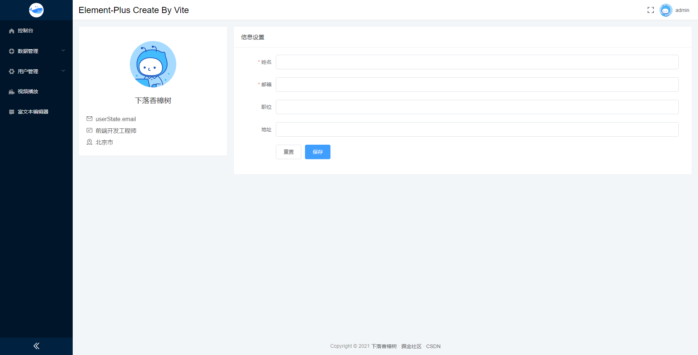
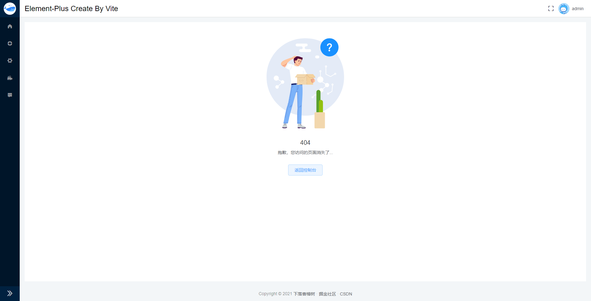

# vite_admin

#### Project composition

vite2 + vue3 + vue-router4 + vuex4 + element-plus

#### Project setup

```
yarn install
```

#### Compiles and hot-reloads for development

```
yarn dev
```

#### Compiles and minifies for production

```
yarn build
```

#### Customize configuration

-   See [Vite](https://cn.vitejs.dev/)
-   See [Vue](https://v3.cn.vuejs.org/)
-   See [Vue Router](https://next.router.vuejs.org/)
-   See [Vuex](https://next.vuex.vuejs.org/)
-   See [Element Plus](https://element-plus.gitee.io/#/zh-CN)

### 页面展示

#### Login 用户登录



#### Index 控制台



#### Data 数据管理



#### Editor 富文本编辑器



#### Player 西瓜播放器



#### User 个人中心



#### 404 Not Found


